<p align="center">
  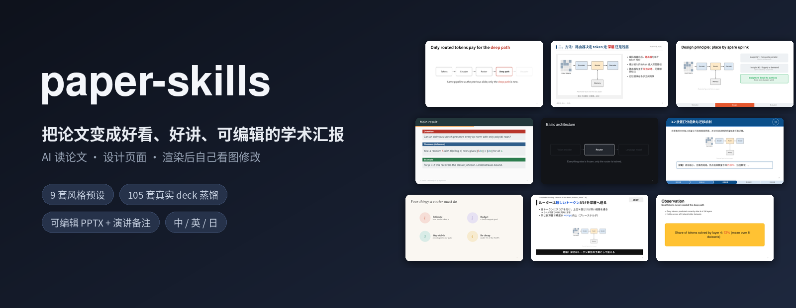
</p>

<p align="center"><a href="README.md">中文</a> · <b>English</b></p>

<p align="center">
  <a href="LICENSE"></a>
  
  
  
  
</p>

<p align="center">
  <b>Two Skills for AI agents: read the paper → design the talk → render and revise by actually looking at the slides → deliver an editable PPTX + speaker notes.</b><br>
  Not “fill a template to make a PPT”, but an AI that finishes a whole talk like a research assistant plus a visual editor.
</p>

<p align="center">
  <a href="#-get-started-in-three-steps">Get started</a> ·
  <a href="#-what-to-say-to-the-ai">What to say</a> ·
  <a href="#-what-goes-on-each-slide-content-distillation">Content distillation</a> ·
  <a href="#-9-style-presets">Style presets</a> ·
  <a href="#-workflow">Workflow</a> ·
  <a href="#-local-toolchain-optional">Local toolchain</a> ·
  <a href="#-faq">FAQ</a>
</p>

---

## ✨ What you get

| | |
|---|---|
| 🎯 **Clear story** | The AI first understands the paper and settles on a storyline, then decides what each slide says; every number and claim traces back to the paper |
| 🎨 **Looks professional** | 9 style presets distilled from 105 real academic decks (top systems venues, ML tutorials, top-university courses, Chinese thesis defenses, Japanese/Korean tech talks) |
| 👀 **Actually checked** | Every batch of slides is rendered to images; the AI looks at them, finds problems and fixes them, instead of handing over whatever it generated |
| 🗣 **Asks first** | Before starting it asks about the occasion, length, audience and style; after reading the paper it shows you the outline, and after the sample slides it checks in again, so you never discover a wrong direction only at the end |
| ✏️ **Stays editable** | Output is an editable PPTX: text, annotations and hand-drawn diagrams can all be changed; every slide comes with Chinese/English speaker notes |
| 🧾 **Reviewable process** | Keeps `source-notes` / `storyboard` / `qa-summary`, so later local edits don't start from scratch |

---

## 🚀 Get started in three steps

### ① Put the Skills into your AI client

This repo is just two Skill folders, each with a `SKILL.md` (the manual the AI reads) and supporting scripts:

```bash
git clone https://github.com/smallSheep123/paper-skills.git
```

| Your AI | Where to put it |
|---|---|
| **Claude Code** | `.claude/skills/` in the project, or globally in `~/.claude/skills/` |
| **Codex CLI** | `~/.codex/skills/` (check Codex's current docs) |
| **Other Skill-capable agents** | The skills directory your client uses, commonly `<project>/.agents/skills/` |
| **AIs without Skill support** (web chat, etc.) | Send it the contents of `paper-ppt/SKILL.md`, or have it read that file first; without local execution it can only produce content/structure drafts |

```text
<skills directory>/
├── paper-extract/   # paper → AI-readable material (screenshots / text / figure & table inventory / MinerU)
└── paper-ppt/       # paper → presentation PPT (understanding, design, sample slides, visual iteration, delivery)
```

> The two Skills can be used separately. If your AI can already read PDFs and images reliably, installing only `paper-ppt` is fine.

### ② Give the paper to the AI with one sentence

```text
Use paper-ppt to turn this paper into a lab-meeting presentation. Paper: ./paper.pdf
```

### ③ Answer the AI's questions: it starts only once things are clear

The AI **won't just start building the moment it gets the paper**. It checks in with you at three points, each time with defaults, so you can reply with just numbers or “default”:

| Gate | When | What it asks |
|---|---|---|
| **G1 Requirements interview** | Before starting | Occasion (lab meeting / conference talk / defense / course / work report), length and level of detail, audience, language, style, the point you most want to make, whether you're an author or a reader, which computer it will be presented on |
| **G2 Outline check** | After reading the paper | One-sentence storyline + a title for each slide (assertion-style) + what goes into backup slides |
| **G3 Sample-slide check** | After the method and results slides | Whether you're happy with the style, text density, fonts and colors |

The first round looks roughly like this:

> A few things before I start. Just reply with numbers; anything you skip uses the default:
> 1. Occasion: lab-meeting paper reading / presenting your own paper / defense / course presentation / work report? (default: lab-meeting paper reading)
> 2. Level of detail: brief, about 10 slides, 8–10 minutes; or detailed, about 18–20 slides, 15–20 minutes? (default: detailed)
> 3. Audience: same subfield / same field, different subfield / non-experts or a committee? (default: same field, different subfield)
> 4. Language: Chinese for both slides and notes? (default: yes)
> 5. Style: any preset, screenshots or university template you want to use? If not, I'll recommend one for the occasion.
> 6. Which point of the paper do you most want the audience to remember?

In a hurry? Say “**your call**”: the AI only asks about level of detail, uses defaults for everything else, and lists the decisions it made for you at delivery. The full question bank is in [intake.md](paper-ppt/references/intake.md).

---

## 💬 What to say to the AI

Copy directly and replace what's in angle brackets.

<details open>
<summary><b>Lab-meeting talk (most common)</b></summary>

```text
Use paper-ppt to turn <paper.pdf> into a 15-minute lab-meeting presentation, style domestic.
First understand the paper and its original figures and tables, then draft the method and results slides; render them, review the images yourself and revise, then finish the full deck.
Write speaker notes for every slide; every number must be traceable to the paper. Don't make up conclusions.
```

It works in Chinese too, for example:

```text
用 paper-ppt 把 <paper.pdf> 做成 15 分钟中文组会汇报，风格用 domestic。
先读懂论文和原始图表，再做方法页、实验页样稿；渲染后自己看图修改，再完成全稿。
每页写演讲备注，数字必须能在论文里找到出处，不要编造结论。
```
</details>

<details>
<summary><b>Systems / networking / storage papers</b></summary>

```text
Use paper-ppt to make a 20-minute talk on <paper.pdf>, style systems-talk:
a contribution tracker bar at the bottom, Insight cards that accumulate slide by slide, and ratio arrows on results slides marking the single most important number.
```
</details>

<details>
<summary><b>PhD / master's defense, proposal, mid-term review</b></summary>

```text
Use paper-ppt to make my PhD defense PPT, style defense-cn, with the primary color changed to <university standard color>.
Materials: <dissertation.pdf> and <published-paper-1.pdf> <published-paper-2.pdf>.
Organize by dissertation chapter, recap the outline before each chapter, and end with a slide listing the contributions and the corresponding publications.
```
</details>

<details>
<summary><b>English reading group / conference rehearsal</b></summary>

```text
Use paper-ppt to make a 12-minute English talk for <paper.pdf>, style keynote-minimal.
Assertion titles, one idea per slide, speaker notes in English.
```
</details>

<details>
<summary><b>Give reference images so it learns the style</b></summary>

```text
Use paper-ppt to make a lab-meeting PPT for <paper.pdf>. Use these screenshots as style references: <ref1.png> <ref2.png>.
Learn only the colors, hierarchy and whitespace; don't copy the logos or layout slots.
```
</details>

<details>
<summary><b>Revise an existing PPT</b></summary>

```text
Use paper-ppt to polish <my-talk.pptx>: only change the method section on slides 5–8, with bigger figures and less text,
and leave the other slides alone. Render a before/after comparison for me when you're done.
```
</details>

**Tips**

- State the **length / slide count, language and audience**, and the AI won't need to ask;
- Name the preset you want; if you don't, Chinese defaults to `domestic` and English to `international`;
- You can always include requirements like “don't make things up” or “numbers need sources”; the Skill also does a final fact check on its own;
- For local edits, give the slide numbers; by default the AI only touches the relevant slides.

---

## 📑 What goes on each slide: content distillation

[page-content-guide.md](paper-ppt/references/page-content-guide.md) distills **content-level** rules from 105 real decks; the AI must read it before writing an outline:

- **Slide-order templates for 6 occasions**: lab-meeting paper reading, conference talk, degree defense (including proposal/mid-term), course tutorial, work report, keynote / job talk, with each slide marked “required / optional” and “what question this slide answers”;
- **Content contracts for 18 slide types**: title, one-slide summary, motivation, related work, insight, contributions, method overview, method details, experimental setup, main results, ablation, limitations, conclusion, backup slides… each spelling out what it must contain, what not to put on it, and a text budget;
- **Patterns read from the data**:

| Occasion | Median slides | Median words/slide | Motivation / Method / Results |
|---|---:|---:|---|
| Conference talk | 38 | 36 | 35 / 40 / 25 |
| Degree defense | 79 | 46 | 20 / 42 / 38 |
| Course lecture | 51 | 48 | 12 / 78 / 10 |
| Lab meeting / report | 27–28 | 48 | 40 / 40 / 20 |

Slide counts include PDF pages exported from animation build steps. Habits shared by the highest-rated decks: the title is the conclusion, one idea per slide, one main figure carried through the whole talk, a “This work” slide right after the motivation, results slides that state the conclusion before showing the figure, and an ending with a takeaway rather than “Thank you”.

---

## 🎨 9 style presets

Preset = fonts / font sizes / color semantics / grid + a set of slide archetypes. It is a starting point, not a template: the AI reworks compositions and splits slides to fit the paper's content.

<table>
<tr>
<td width="33%" align="center">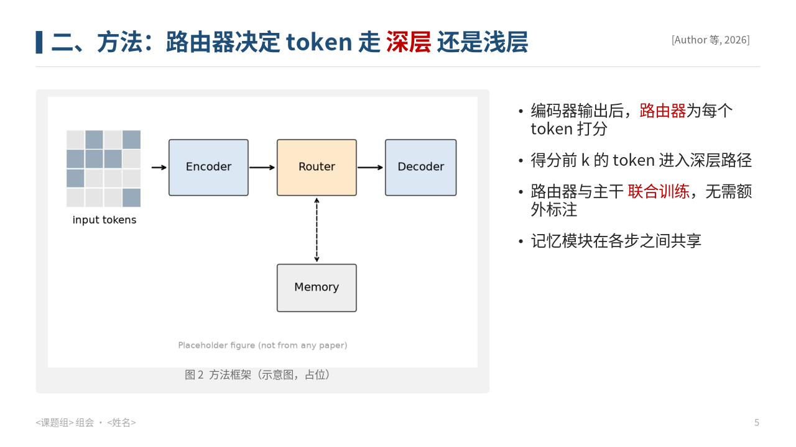<br><a href="paper-ppt/styles/domestic/STYLE.md"><b>domestic</b></a><br><sub>Chinese lab meeting: outline navigation, keywords in red, caption boxes under figures</sub></td>
<td width="33%" align="center">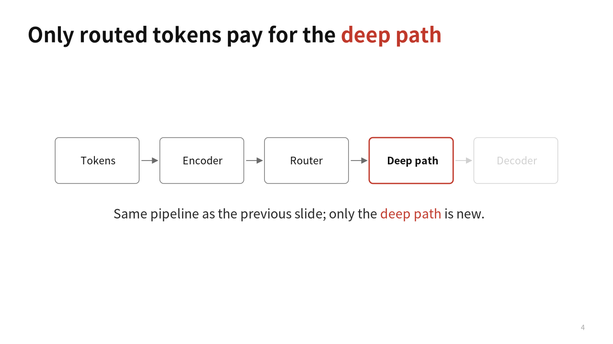<br><a href="paper-ppt/styles/international/STYLE.md"><b>international</b></a><br><sub>English lab meeting: assertion titles, incremental builds, a single accent color</sub></td>
<td width="33%" align="center">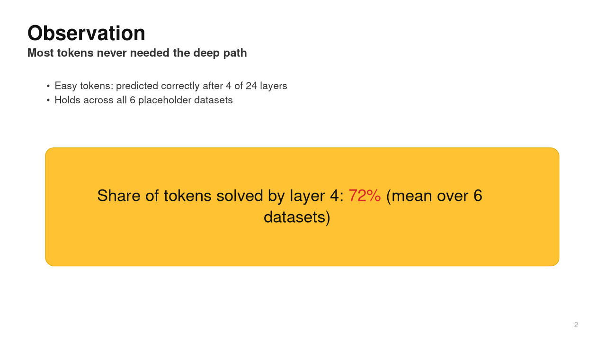<br><a href="paper-ppt/styles/keynote-minimal/STYLE.md"><b>keynote-minimal</b></a><br><sub>Launch-event minimalism: bold title + conclusion subtitle, observation cards</sub></td>
</tr>
<tr>
<td align="center">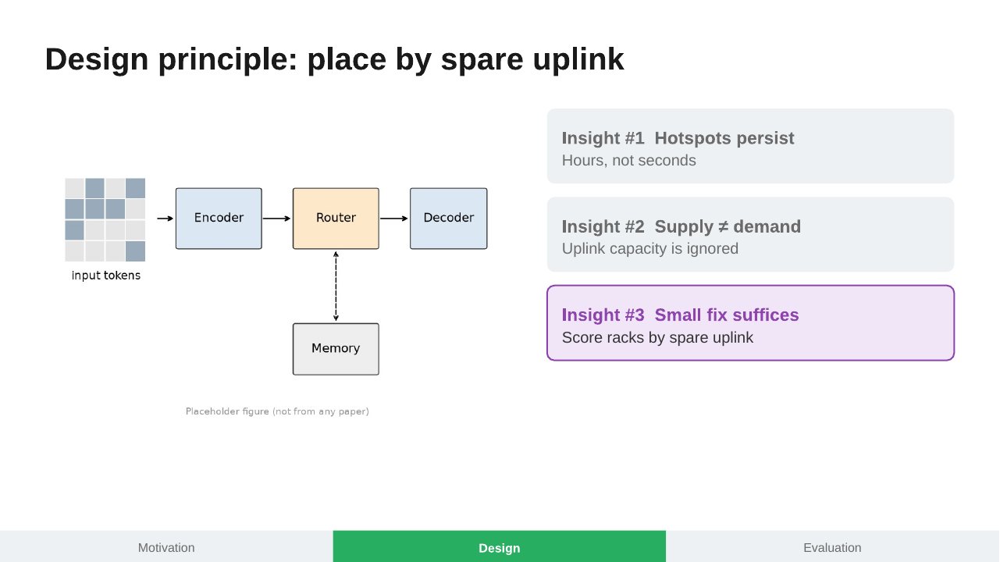<br><a href="paper-ppt/styles/systems-talk/STYLE.md"><b>systems-talk</b></a><br><sub>Top systems venues: contribution tracker, Insight cards, ratio results</sub></td>
<td align="center">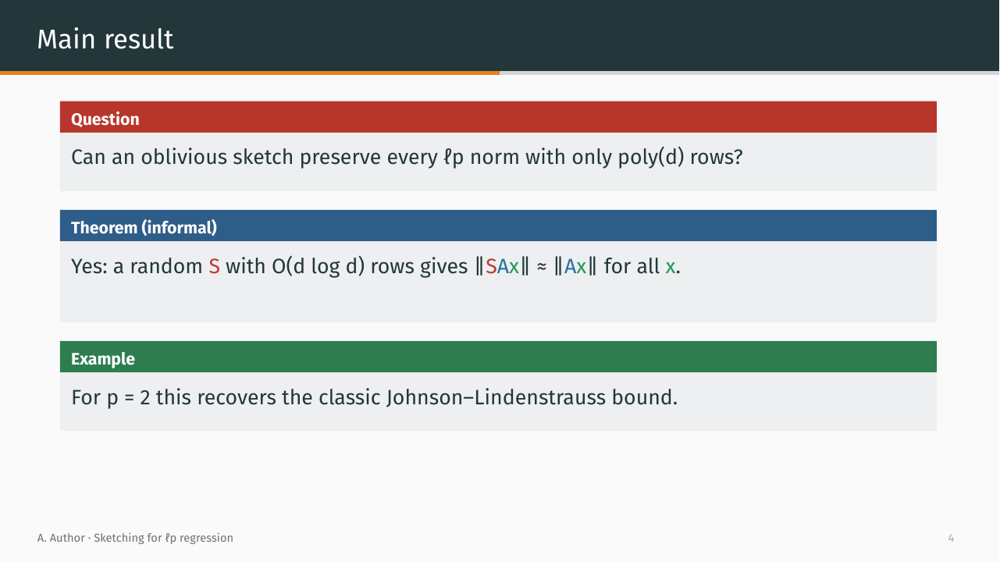<br><a href="paper-ppt/styles/theory-beamer/STYLE.md"><b>theory-beamer</b></a><br><sub>Theory talks: progress line, theorem blocks, symbol color-coding</sub></td>
<td align="center">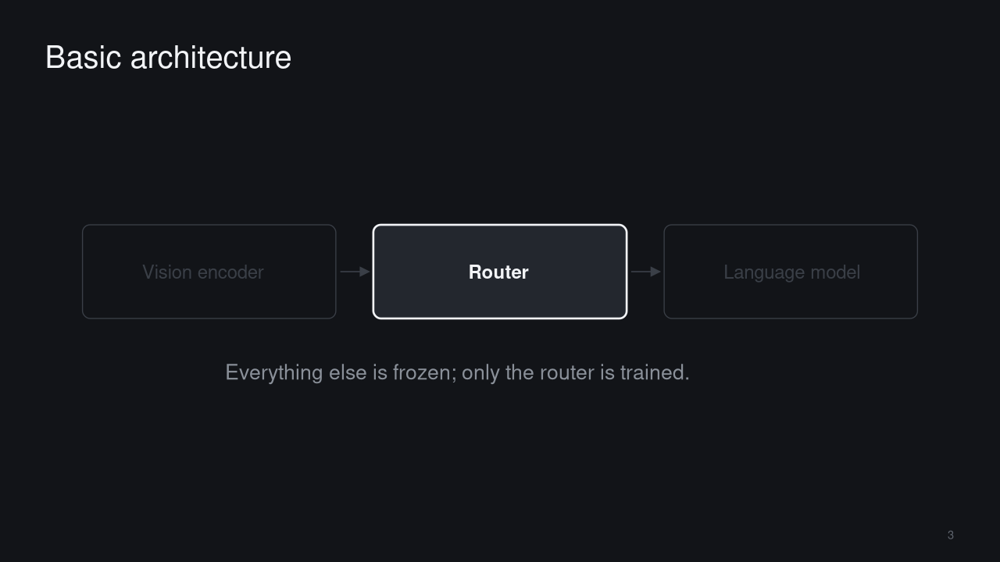<br><a href="paper-ppt/styles/dark-tech/STYLE.md"><b>dark-tech</b></a><br><sub>Dark tech: contrasting-color title slide, focus-dim builds</sub></td>
</tr>
<tr>
<td align="center">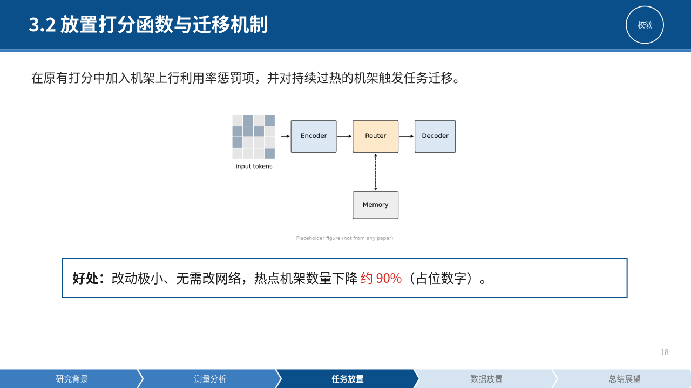<br><a href="paper-ppt/styles/defense-cn/STYLE.md"><b>defense-cn</b></a><br><sub>Chinese defenses: university-color title band, chapter navigation, conclusion boxes</sub></td>
<td align="center">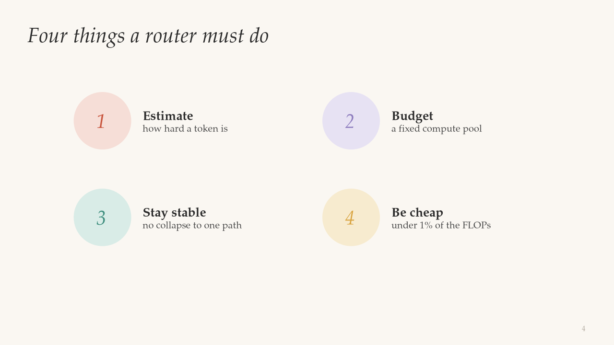<br><a href="paper-ppt/styles/editorial/STYLE.md"><b>editorial</b></a><br><sub>Illustrated magazine style: serif italics, one image per slide</sub></td>
<td align="center">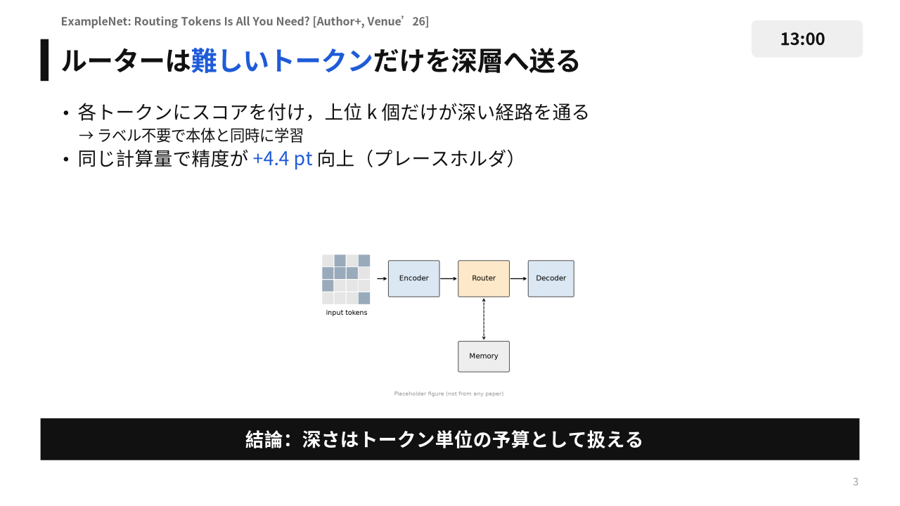<br><a href="paper-ppt/styles/jp-gothic/STYLE.md"><b>jp-gothic</b></a><br><sub>Japanese/Korean tech talks: paper citation line, black conclusion banner</sub></td>
</tr>
</table>

**How to choose**

| Occasion | Use this |
|---|---|
| Chinese lab-meeting paper reading | `domestic` |
| English lab meeting / reading group | `international` or `keynote-minimal` |
| Systems, networking, storage, databases | `systems-talk` |
| Theory, algorithms, cryptography, math | `theory-beamer` |
| Industry talks, tech meetups | `dark-tech` |
| HCI, visualization, graphics, popular science | `editorial` |
| Defenses, proposals, mid-term reviews, grant reports | `defense-cn` |
| Japanese / Korean, or dense Japanese-style talks | `jp-gothic` |

**Each preset comes with a font list and a base template**

| Preset | Latin first choice | CJK first choice | Base template |
|---|---|---|---|
| `domestic` | Arial | Microsoft YaHei | [template.pptx](paper-ppt/styles/domestic/template.pptx) |
| `international` | Arial | Microsoft YaHei | [template.pptx](paper-ppt/styles/international/template.pptx) |
| `keynote-minimal` | Helvetica Neue | PingFang | [template.pptx](paper-ppt/styles/keynote-minimal/template.pptx) |
| `systems-talk` | Arial | Microsoft YaHei | [template.pptx](paper-ppt/styles/systems-talk/template.pptx) |
| `theory-beamer` | Fira Sans + Cambria Math | Source Han Sans | [template.pptx](paper-ppt/styles/theory-beamer/template.pptx) |
| `dark-tech` | Inter + JetBrains Mono | PingFang | [template.pptx](paper-ppt/styles/dark-tech/template.pptx) |
| `editorial` | Palatino Linotype | Source Han Serif | [template.pptx](paper-ppt/styles/editorial/template.pptx) |
| `defense-cn` | Arial | Microsoft YaHei | [template.pptx](paper-ppt/styles/defense-cn/template.pptx) |
| `jp-gothic` | Noto Sans JP | Noto Sans JP | [template.pptx](paper-ppt/styles/jp-gothic/template.pptx) |

- **Templates**: each slide is a real layout of that style, with the text replaced by placeholder guidance like “[assertion title + keywords]”, and the speaker notes describe what content belongs on that slide;
- **Fonts**: [fonts.md](paper-ppt/references/fonts.md) lists each font's source, license and open-source alternative, plus the “safe font set” to use when presenting on a venue computer; `python paper-ppt/scripts/check_fonts.py domestic` checks which ones are missing on your machine.
- **Open fonts**: open-licensed Latin fonts are bundled in `paper-ppt/fonts/`; CJK fonts (Noto Sans SC / Noto Serif SC / Noto Sans JP) are fetched and installed with `python paper-ppt/scripts/get_fonts.py --install`. Set `PAPER_PPT_FONTS=open` when generating and any preset switches to the open font track, so decks render identically on every machine (details in [fonts.md](paper-ppt/references/fonts.md) §0).

Curious where these styles come from? The [style atlas](paper-ppt/references/slide-style-atlas.md) records measured fonts, text density and layout clusters for 105 real decks (for example, the highest-rated decks have a median of 38 words per slide, the lower-rated ones 51).

---

## 🔁 Workflow

<p align="center">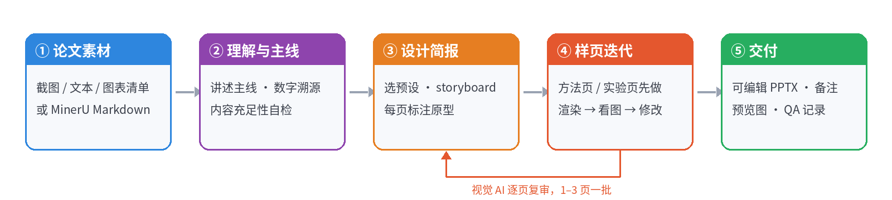</p>

| Stage | What the AI does | What it leaves behind |
|---|---|---|
| ① Material | Screenshots every page, extracts text, builds a Figure/Table inventory, crops high-resolution figures as needed; uses MinerU for scans or equation-heavy papers | `pages/`, `inventory.md` |
| ⓪ Interview | Clarifies occasion, length, audience, language, style and presentation setup (G1) | Interview record in `design-brief.md` |
| ② Understanding | Finds the storyline worth telling, verifies key numbers, checks the material can support the chosen level of detail | `source-notes.md` |
| ③ Design | Writes the outline from the occasion's slide-order template, one-sentence conclusion per slide; sends it to you for review (G2) | `storyboard.md` |
| ④ Sample slides | Builds the method and results slides first: render → look → revise, and sends them to you for review (G3); then finishes the deck in batches of 1–3 slides | Renders from each round, `review-log.json` |
| ⑤ Delivery | Final fact check + full-deck visual review | `deck.pptx`, `speaker-notes.md`, `contact-sheet.png`, `qa-summary.md` |

**Clear division of labor:** the AI handles understanding, selection, design and aesthetic judgment; the code only handles screenshot cropping, PPTX generation, render previews and version records. The code never picks a template automatically and never replaces the vision model looking at the slides.

---

## 🛠 Local toolchain (optional)

If your host AI can already read PDFs and generate and render PPTs, you can skip this section.

<details>
<summary><b>Paper material: Path A (native, no models, default)</b></summary>

Only needs Poppler (`pdftoppm` / `pdftotext`) or `pip install pymupdf`:

```bash
python paper-extract/scripts/pdf_snap.py pages     paper.pdf --out work/pages
python paper-extract/scripts/pdf_snap.py text      paper.pdf --out work/paper.txt.md
python paper-extract/scripts/pdf_snap.py inventory paper.pdf --out work/inventory.md
python paper-extract/scripts/pdf_snap.py crop      paper.pdf --page 5 --box 0.05,0.08,0.45,0.30 --out work/figs/fig4.png
```

The AI looks at the screenshots to decide crop coordinates, and runs a [source-sufficiency self-check](paper-ppt/references/source-sufficiency.md) before designing.
</details>

<details>
<summary><b>Paper material: Path B (MinerU, for scans / many equations / many tables)</b></summary>

Can be used alongside Path A:

```bash
python -m pip install -U "mineru>=4.0,<5"
python paper-extract/scripts/mineru_models.py download --tier standard
python paper-extract/scripts/mineru_models.py verify   --tier standard
python paper-extract/scripts/mineru_extract.py /path/to/paper.pdf
```

Model preparation and document parsing are two separate steps; by default only locally downloaded models are used.
</details>

<details>
<summary><b>PPT generation and rendering</b></summary>

```bash
cd paper-ppt
npm install
python -m pip install -r requirements.txt
python scripts/bridge.py doctor          # check the environment
node assets/build-style-samples.js out   # build sample decks for all 9 presets
```

Equations: `scripts/math_assets.py` / `assets/equations.js` render LaTeX to SVG/PNG or simple native OMML (see [math-equations.md](paper-ppt/references/math-equations.md)); structural check: `python scripts/check_deck.py deck.pptx`.

Real rendering needs LibreOffice and Poppler. Without LibreOffice, `scripts/svg_preview.py` gives an approximate preview (line breaks are estimated from character widths; the PPTX as actually opened is what counts). See [INSTALL.md](paper-ppt/INSTALL.md) for details.
</details>

---

## ❓ FAQ

<details>
<summary><b>Do I have to provide a PPTX template?</b></summary>

No. A preset name, a one-line style description, a few screenshots or web slides all work. The AI only extracts colors, hierarchy, whitespace and rhythm, then redesigns for this paper.
</details>

<details>
<summary><b>Do I have to install MinerU?</b></summary>

No. An AI that can see images uses the native screenshot path by default; use MinerU for scans, when you need LaTeX equations, for table-heavy papers, or when the AI can't see images. You can also use both paths together.
</details>

<details>
<summary><b>Will the AI make up numbers?</b></summary>

The Skill requires every number to be traceable to a page, figure or table in the paper; anything the paper doesn't state clearly is marked “unconfirmed” and only the principle is explained. At delivery, `qa-summary.md` states what was checked and what wasn't verified.
</details>

<details>
<summary><b>What if I want to change a few slides afterwards?</b></summary>

Just say “only change slide X, and make this change”. The working directory keeps the storyboard, generation sources and render records, and by default only the relevant slides are touched.
</details>

<details>
<summary><b>Fonts look wrong?</b></summary>

The AI asks about the presentation setup during the interview. When presenting on a venue computer, use the safe font set from [fonts.md](paper-ppt/references/fonts.md), or embed fonts in PowerPoint; `check_fonts.py` lists the fonts missing on your machine and the substitutes that will actually be used.

To rule out font differences entirely: open-licensed Latin fonts are bundled in `paper-ppt/fonts/`, and CJK fonts (Noto Sans SC / Noto Serif SC / Noto Sans JP) are fetched with `python paper-ppt/scripts/get_fonts.py --install`; set `PAPER_PPT_FONTS=open` when generating and any preset switches to the open font track, so decks render identically on every machine (details in [fonts.md](paper-ppt/references/fonts.md) §0).
</details>

---

## 📁 Directory layout

```text
paper-skills/
├── paper-extract/                 paper → AI-readable material
│   ├── SKILL.md
│   └── scripts/
│       ├── pdf_snap.py            screenshots / text / figure & table inventory / high-res crops
│       ├── mineru_models.py       MinerU model download and verification
│       └── mineru_extract.py      MinerU → Markdown
│
├── paper-ppt/                     paper → presentation PPT
│   ├── SKILL.md                   AI workflow manual (start reading here)
│   ├── styles/                    9 style presets: STYLE.md · tokens.json · template.pptx · refs/ · samples/
│   ├── references/                interview question bank, slide content guide, font list, style guide, visual review protocol, style atlas
│   ├── assets/                    PPTX drawing: style-presets*.js, ppt-helpers.js
│   └── scripts/                   bridge.py rendering · check_deck.py · check_fonts.py · math_assets.py · svg_preview.py
│
├── docs/images/                   README images
└── tests/                         tool tests
```

**Design references**: [Academic Evidence style case study](paper-ppt/styles/academic-evidence/STYLE.md) · [Equation rendering](paper-ppt/references/math-equations.md) · [Interview question bank](paper-ppt/references/intake.md) · [Slide content guide](paper-ppt/references/page-content-guide.md) · [Font list](paper-ppt/references/fonts.md) · [Style guide](paper-ppt/references/style-guide.md) · [Talk structure](paper-ppt/references/talk-structure.md) · [Visual review protocol](paper-ppt/references/visual-review.md) · [Style distillation gallery](paper-ppt/references/slide-style-gallery.md) · [Style atlas](paper-ppt/references/slide-style-atlas.md) · [Academic Clean](paper-ppt/references/academic-clean.md) / [Rich](paper-ppt/references/academic-rich.md)

---

## 🧪 Development

```bash
python -m unittest discover -s tests -v
```

The tests check tool wiring, version records, preset builds and low-level script behavior; they **do not replace fact-checking against the paper, vision-model review of the slides, or real PowerPoint compatibility testing**.

The project does not include a paper library, model keys or personal configuration; `paper-ppt/fonts/` contains only redistributable open-licensed fonts (each with its licence), and no commercial fonts are shipped; real-slide screenshots in `refs/` are low-resolution, credited citations used only to illustrate design techniques.

## License

[MIT](LICENSE)
