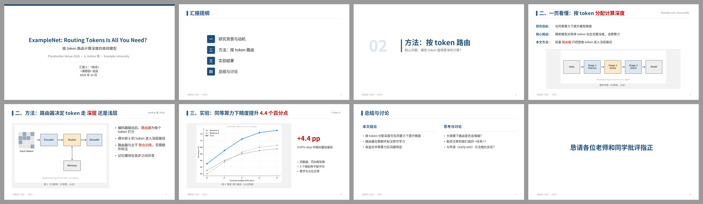
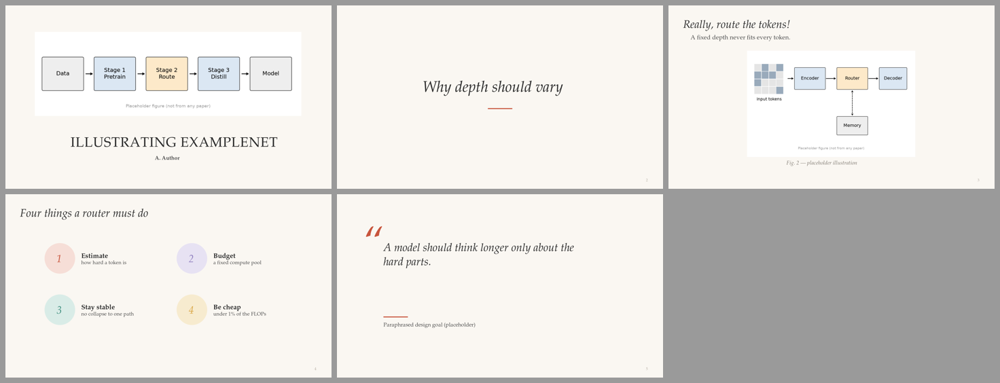
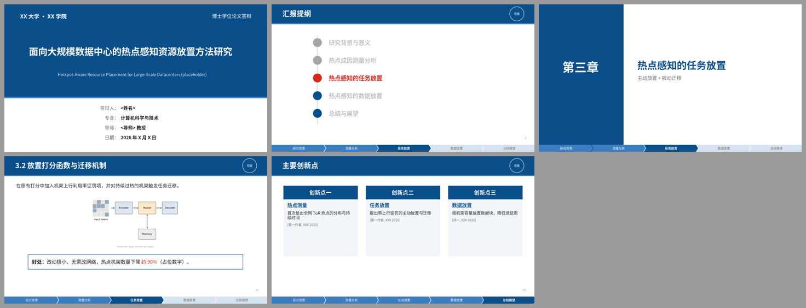

# 风格预设（Style Presets）

九套可直接调用的风格预设，与 `references/` 中的设计原则配合使用。

| 预设 | 一句话 | 示例 |
|---|---|---|
| [International](international/STYLE.md) | 海外组会 / 会议：白底、标题即结论、增量构建、唯一强调色 |  |
| [Domestic](domestic/STYLE.md) | 国内组会 / 学术报告：提纲导航、标题色块 + 关键词标红、图注承托框、结尾讨论 |  |
| [Keynote Minimal](keynote-minimal/STYLE.md) | 白底极简发布会式：粗标题 + 加粗结论副标题、黄色观察卡、focus 构建 |  |
| [Systems Talk](systems-talk/STYLE.md) | 系统顶会：贡献追踪条、累积 Insight 卡、比值箭头、深色代码页、结论横幅 |  |
| [Theory Beamer](theory-beamer/STYLE.md) | Metropolis 式理论报告：进度线、定理/问题/例子色块、一个符号一种颜色 |  |
| [Dark Tech](dark-tech/STYLE.md) | 深色科技发布会：撞色封面、细体章节、focus-dim、白框承托论文图 |  |
| [Editorial](editorial/STYLE.md) | 插画杂志风：暖白底、衬线斜体标题、一页一图、概念色圆点 |  |
| [Defense CN](defense-cn/STYLE.md) | 国内答辩：校色标题带、编号标题、章节箭头导航、提纲回显、创新点卡片 |  |
| [JP Gothic](jp-gothic/STYLE.md) | 日韩技术发表：粗黑体、黑竖条标题、论文出处行、时间徽章、黑色结论横幅 |  |

后 7 套的来源与选择依据见 [slide-style-atlas.md](../references/slide-style-atlas.md)（105 套真实 deck 的字体、版式、内容分布与画风统计）。

每个预设目录包含：

```text
<style>/
├── STYLE.md      字体、字号、配色语义、网格、页面原型、推荐页序、硬性约束
├── tokens.json   机器可读的设计 token（style-presets.js 读取）
├── refs/         蒸馏来源的真实 slides 截图（低分辨率，注明出处）
└── samples/      用预设生成的示例页（虚构占位论文）
```

代码：

- `assets/style-presets.js`：`loadTokens()`、`drawSlide()`、International / Domestic 原型；`assets/style-presets-extra.js`：其余 7 套原型；
- 行内标记：`[[x]]` 强调色、`**x**` 加粗、`{{n:x}}` 第 n 个概念色（`tokens.color.sym`）；同一套绘制调用可输出 PPTX（`PptxCanvas`）或 SVG 预览（`SvgCanvas`）；
- `assets/build-style-samples.js`：生成两套示例 deck 与 SVG 预览（`npm run samples`）；
- `scripts/svg_preview.py`：SVG → PNG + 总览图，用于没有 LibreOffice 时快速看图。

**SVG 预览只是近似（换行按字符宽度估算），最终视觉验收仍以 PPTX 的真实渲染为准**（`scripts/bridge.py`）。

## 与 paper-ppt 工作流的关系

1. Design 阶段按语言 / 场景选择预设，写入 `design-brief.md`；
2. storyboard 中每页标注计划使用的原型（如 `method`、`result`），没有合适原型的页面由 AI 自由绘制，但仍遵守该预设的 token 与硬性约束；
3. 样页阶段用预设出方法页和结果页，渲染后看图修改；
4. 预设是起点，不是锁定的模板：可以改坐标、换原型、拆页。

## 新增一套预设

1. 复制 `international/` 为新目录，改 `tokens.json` 的 `name`；
2. 在 `style-presets-extra.js` 返回的对象中注册同名原型集合（可复用已有原型）；
3. 在 `build-style-samples.js` 中加示例，运行 `npm run samples` 并检查 `samples/`；
4. `refs/` 只放低分辨率截图并注明来源。
