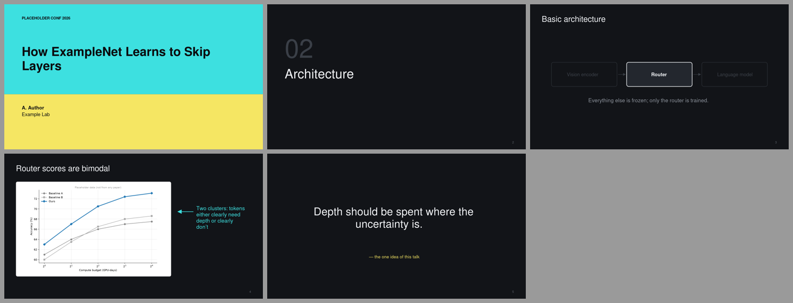
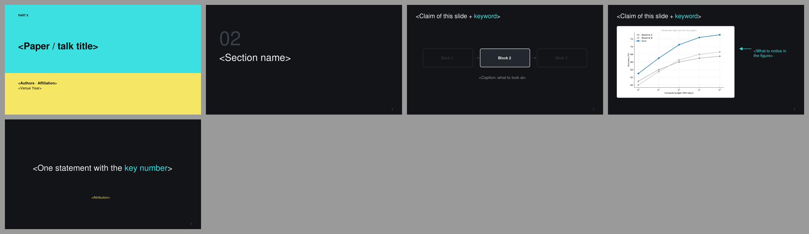

# Dark Tech · 深色科技发布会

> 深色底、双色撞色封面、细体大字章节页、focus-dim 构建、单一高亮色注释。  
> 蒸馏自 [slide-style-atlas.md](../../references/slide-style-atlas.md) 中归入本预设的样本；参考截图见 `refs/`。

## 1. 何时使用

- 工业界分享、技术沙龙、产品化开源项目介绍；
- 投影环境暗、需要强对比时；
- 图是自绘线框图而非论文截图时（论文白底图需加白色承托框）。

## 2. Token（`tokens.json`）

- 字体：Inter / Segoe UI；中文 苹方 / 微软雅黑（`fonts.heading` / `fonts.body` 决定 PPTX 字体，`fonts.preview` 只用于 SVG 预览）
- 字号：封面 46 · 标题 30 · 正文 20 · 辅助 16 · 章节 48

| 颜色 | 值 |
|---|---|
| `bg` | `#121418` |
| `bgDeep` | `#0B0C0F` |
| `bgRaised` | `#23272E` |
| `text` | `#F2F4F7` |
| `body` | `#D0D4DA` |
| `muted` | `#8A9099` |
| `faint` | `#5E646D` |
| `ghost` | `#3A3F47` |
| `primary` | `#F2F4F7` |
| `accent` | `#3DE0E0` |
| `accent2` | `#F5E663` |
| `frame` | `#23272E` |
| `rule` | `#3A3F47` |

语义：

- `accent`：注释、箭头、当前项
- `accent2`：封面第二色带、署名
- `ghost`：focus 构建中被压暗的模块（不删除，保持空间记忆）

## 3. 页面原型

| 原型 | 说明 |
|---|---|
| `cover` | 上青下黄撞色色块 + 深色大标题 |
| `section` | 超大细体编号 + 细体章节名 |
| `focus` | 线框模块，当前模块亮白描边，其余压暗 |
| `explain` | 白色承托框放论文图 + 青色箭头注释 |
| `statement` | 一句话居中大字 + 黄色署名 |

示例 deck：`node assets/build-style-samples.js out` 后查看 `out/dark-tech-sample.pptx`。

## 4. 硬性约束

- 正文页只用一个高亮色（青）；第二色（黄）只用于封面和署名
- 论文原图一律放在白色圆角承托框里，不要直接贴在深底上
- 每页英文 ≤ 25 词；细体只用于 ≥ 40 pt 的大字
- 预设是起点不是模板：坐标、原型都可以改，但 token 语义不变。

## 5. 参考来源（低分辨率截图，仅用于说明手法）

| 截图 | 来源 | 风格族 | 链接 |
|---|---|---|---|
| `refs/kakao_ko-p32.jpg` | 이미지까지 이해하는 Multimodal LLM의 학습 방법 밝혀내기 — 강우영 (edwin.ai), Kakao（if(kakaoAI)2024） | dark tech keynote, focus-dim builds | [PDF](https://files.speakerdeck.com/presentations/e2ac5783917545b79ac42c06e9447045/1107_edwin.ai_kakao.pdf) |
| `refs/jasonwei-p12.jpg` | Scaling paradigms for large language models — Jason Wei (OpenAI)（invited guest lecture (llm-class, 2024 H2)） | dark Google Sans explainer | [PDF](https://llm-class.github.io/slides/Jason_Wei.pdf) |
| `refs/bachkey-p1.jpg` | Dealing with Data (keynote) — Benjamin Bach, University of Edinburgh（Dealing with Data 2019, Edinburgh (Jan 2020)） | thin-type black/white alternating keynote | [PDF](https://vishub.net/pdfs/dealing_vis_data_keynote.pdf) |
| `refs/klimovic-p28.jpg` | Data Management for Cost-Efficient ML — Ana Klimovic / ETH Zürich (EASL, Systems Group)（EuroSys 2024 CHEOPS workshop keynote） | Avenir light minimal + dark code-walkthrough slides | [PDF](https://cheops-workshop.github.io/talks2024/EuroSys24_CHEOPSkeynote_klimovic_CostEffectiveML.pdf) |

## 字体与基础模板

| 角色 | 首选 → 回退 | 开源替代 |
|---|---|---|
| 西文 | Inter → Segoe UI → Arial | （开源） |
| 中日文 | PingFang SC → Microsoft YaHei → Noto Sans SC | 思源黑体 / Noto Sans SC |
| 等宽 | JetBrains Mono → Consolas → DejaVu Sans Mono | （开源） |

- 检查本机字体：`python scripts/check_fonts.py dark-tech`；来源、授权与安全字体组见 [fonts.md](../../references/fonts.md)。
- 基础模板：[template.pptx](template.pptx)（每页是带占位说明的原型，演讲备注写明这页该放什么），预览：

- 每页放什么内容：[page-content-guide.md](../../references/page-content-guide.md)。
