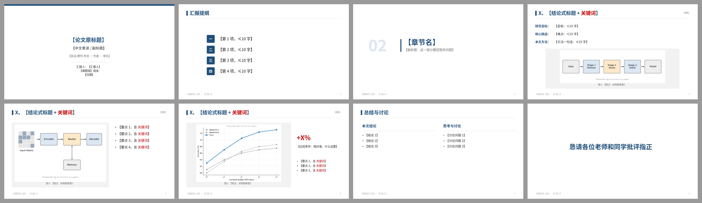

# Domestic · 国内组会 / 学术报告风格预设

> 白底深蓝、标题带色块与关键词标红、提纲导航、图配浅灰承托框和中文图注、结尾留讨论问题。  
> 蒸馏自胡瀚 VALSE 2023 年度进展报告与李宏毅 NTU 课程 slides（见 `refs/`），并结合国内高校组会的常见要求。  
> 预设 = token + 页面原型 + 绘制函数；AI 仍需针对论文决定 message、裁图和最终构图。


## 1. 何时使用

- 中文组会、课题组论文分享、开题 / 中期、国内学术会议报告；
- 听众包括导师和不同方向的同学，需要清楚的提纲和“个人思考”。

## 2. Token（`tokens.json`）

### 字体

| 用途 | 首选 | 回退 |
|---|---|---|
| 中文 | Microsoft YaHei（微软雅黑） | PingFang SC → Source Han Sans SC（思源黑体）→ Noto Sans SC |
| 英文 / 数字 | Arial | Helvetica |
| 代码 | Consolas | Menlo → DejaVu Sans Mono |

不用宋体 / 楷体做正文；方法名、数据集、指标保留英文原名。字体文件不随仓库分发。

### 字号（pt，16:9）

| 元素 | 字号 | 规则 |
|---|---|---|
| 封面论文标题 | 30 bold | 原文题目，≤ 2 行；下方可加中文译名 20 pt |
| 页标题 | 28 bold，主色 | **≤ 20 字**（含“二、”前缀），超过就拆成标题 + 副标题 |
| 正文 | 19–20 | 每页 ≤ 4 条，每条 ≤ 28 字，最多 2 级 |
| 辅助 / 实验条件 | 16 | |
| 图注 | 13 | 图下方居中，“图 N  中文说明” |
| 出处标签 / 页脚 / 页码 | 11–12 | 浅灰 |
| 大数字 | 36 bold | 每页最多 1 个 |
| 章节页标题 | 40 bold | 配 88 pt 浅色章节号 |

### 配色

| Token | 色值 | 含义 |
|---|---|---|
| `primary` | #1F4E79 | 标题、标题色块、章节号、提纲当前项、自绘图主模块 |
| `primaryLight` | #DCE6F1 | 提纲非当前项底色、章节大号数字、分栏下划线 |
| `accent` | #C00000 | 标题关键词、正文关键词、结果页唯一强调数字 |
| `body` | #262626 | 正文 |
| `muted` | #6B6B6B | 出处标签、图注 |
| `faint` | #A6A6A6 | 页脚、页码、非当前项文字 |
| `frame` | #F2F2F2 | 论文原图承托框 |
| `rule` | #D9D9D9 | 标题下细线 |

可以把 `primary` 换成学校标准色（在 design-brief 中写明），但 accent 保持红色系、全稿只一种。

### 网格

- 左右边距 0.6 in；标题色块 0.11 × 0.38 in，紧贴标题左侧；
- 标题下 0.75 pt 细线 y = 1.12 in；内容区 y = 1.35–6.75 in；
- 页脚 y = 7.0 in：左“课题组 组会 · 汇报人”，右页码；
- 图文双栏默认 **58 / 42**；图放在 `frame` 承托框中，内边距 0.12–0.15 in。

## 3. 页面原型（`assets/style-presets.js` → `domestic.*`）

| 原型 | 用途 | 结构约束 | 参考 |
|---|---|---|---|
| `cover` | 封面 | 原文题目 / 中文译名 / 会议·作者·单位 / 汇报人·课题组·日期；顶部主色细条 | — |
| `outline` | 汇报提纲 | 3–5 项，“一、二、三”方块编号；章节开头可再次出现并高亮当前项 | — |
| `section` | 章节页 | 大号浅色编号（02）+ 主色竖条 + 标题 + 一句核心问题 | — |
| `paperGlance` | 一页看懂 | “研究目标 / 核心挑战 / 本文方法”三行（各 ≤ 1 行）+ 一张总览图 | `refs/huhan-title-keyword.jpg` |
| `method` | 方法页 | 左图（承托框 + 图注）右要点；每条最多 1 个红色关键词 | `refs/huhan-figure-caption.jpg`、`refs/hylee-diagram-vocabulary.jpg` |
| `result` | 结果页 | 原图 + 唯一红色大数字 + 比较对象 + 实验条件 | — |
| `summary` | 总结与讨论 | 两栏：“本文结论” / “思考与讨论”，不用卡片；讨论栏写可以让导师追问的问题 | — |
| `thanks` | 结束页 | 可选，一句话，最多一页 | — |

自绘图词汇：用具体例子（一个中文词、一个 token）走完机制，同一套图元全稿复用（`refs/hylee-visual-equation.jpg`、`refs/hylee-example-driven.jpg`）。

标题前缀：章节内页面在标题前加“一、/二、/三、”，与 `outline` 对应（`refs/huhan-progress-prefix.jpg`）。  
出处标签：标题右上 `[机构/作者, 会议年份]`，或条目后小字。

## 4. 推荐页序

**单篇论文组会（10–15 分钟，约 12 页）**

```text
cover → outline
→ section(一、背景与动机) → paperGlance
→ section(二、方法) → method×2–3
→ section(三、实验) → result×2
→ summary(结论 + 思考与讨论) → thanks(可选)
```

**多篇论文 / 方向综述**：`outline` 列出各篇或各方向；每篇一页 `paperGlance` + 1–2 页细节；最后一页对比与讨论。

国内组会常见期待（建议写入 storyboard）：

1. 封面写清原文题目、会议/期刊、作者单位；
2. 第 2 页给提纲；
3. 每篇论文讲清 **动机 → 方法 → 实验 → 个人思考/与本组工作的联系**；
4. 最后一页列可讨论的问题。

## 5. 硬性约束

1. 标题 ≤ 20 字，标题中红色关键词 ≤ 1 处；
2. 正文每条最多 1 个红色关键词，红色不连续超过 6 个字；
3. 论文原图一律放在承托框中并配中文图注，不加阴影、不加设备壳；
4. 结果页只强调一个数，写明比较对象（相对哪条 baseline）和单位（%、pp、×）；
5. 提纲编号、标题前缀、章节页编号三者一致；
6. 不使用模板网站式的大色块背景、渐变横幅、学校大 Logo 水印。

## 6. 用法

```js
const pptxgen = require('pptxgenjs');
const {loadTokens, PptxCanvas, drawSlide} = require('./assets/style-presets');

const t = loadTokens('domestic');
const deck = new pptxgen(); deck.layout = t.slide.layout;

drawSlide(new PptxCanvas(deck.addSlide(), t), t, {
  type: 'method', prefix: '二、',
  title: '方法：路由器决定 token 走 [[深层]] 还是浅层',
  tag: '[Author 等, 2026]',
  figure: 'figs/fig2-crop.png', caption: '图 2  方法框架',
  points: ['编码器输出后，[[路由器]]为每个 token 打分', '得分前 k 的 token 进入深层路径'],
  footer: 'XX 课题组 组会 · 张三', page: 5,
  notes: '这页先看左边框架图……',
});
await deck.writeFile({fileName: 'deck.pptx'});
```

## 7. 参考图来源

`refs/` 为公开 slides 的低分辨率截图，仅用于风格研究与引用说明，版权归原作者：

- 胡瀚，视觉自监督学习年度进展评述，VALSE 2023 — <https://ancientmooner.github.io/doc/VALSE2023_Visual_SelfSupervised_Learning_HanHu.pdf>
- 李宏毅，一堂課看懂語言模型內部運作，NTU 2025 — <https://speech.ee.ntu.edu.tw/~hylee/GenAI-ML/2025-fall-course-data/LLMunderstand.pdf>

`samples/` 为本预设生成的示例页，内容是虚构的占位论文，图是占位图。

## 字体与基础模板

| 角色 | 首选 → 回退 | 开源替代 |
|---|---|---|
| 西文 | Arial → Helvetica | Liberation Sans |
| 中日文 | Microsoft YaHei → PingFang SC → Source Han Sans SC → Noto Sans SC | 思源黑体 / Noto Sans SC |
| 等宽 | Consolas → Menlo → DejaVu Sans Mono | JetBrains Mono / DejaVu Sans Mono |

- 检查本机字体：`python scripts/check_fonts.py domestic`；来源、授权与安全字体组见 [fonts.md](../../references/fonts.md)。
- 基础模板：[template.pptx](template.pptx)（每页是带占位说明的原型，演讲备注写明这页该放什么），预览：



- 每页放什么内容：[page-content-guide.md](../../references/page-content-guide.md)。
