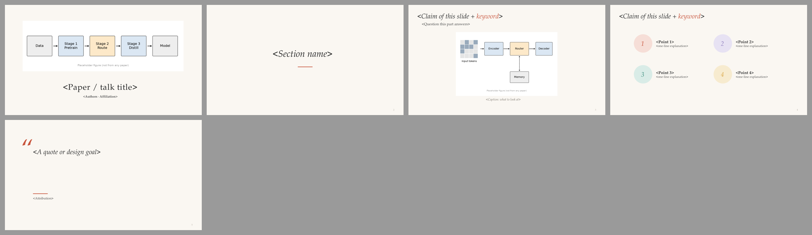

# Editorial · 插画杂志风

> 暖白底、衬线斜体标题、一页一张插画、概念色圆点，像一本图文杂志。  
> 蒸馏自 [slide-style-atlas.md](../../references/slide-style-atlas.md) 中归入本预设的样本；参考截图见 `refs/`。

## 1. 何时使用

- HCI、可视化、图形学、科普、keynote；
- 有自绘插画或高质量示意图的工作；
- 听众偏人文/跨学科时。

## 2. Token（`tokens.json`）

- 字体：Palatino Linotype / Georgia；中文思源宋体 / 宋体（`fonts.heading` / `fonts.body` 决定 PPTX 字体，`fonts.preview` 只用于 SVG 预览）
- 字号：封面 40 · 标题 32 · 正文 20 · 辅助 16 · 章节 44

| 颜色 | 值 |
|---|---|
| `bg` | `#FAF7F2` |
| `primary` | `#8E7DBE` |
| `text` | `#2B2B2B` |
| `body` | `#4A4A4A` |
| `muted` | `#7D776F` |
| `faint` | `#B0A99F` |
| `ghost` | `#DDD6CC` |
| `accent` | `#C8553D` |
| `frame` | `#F1ECE4` |
| `rule` | `#DDD6CC` |

语义：

- `accent`：引号、短分隔线、封面强调
- `sym/tint`：概念色：一个概念一个颜色，插画与文字共用

## 3. 页面原型

| 原型 | 说明 |
|---|---|
| `cover` | 大插画 + 小型大写标题 + 作者 |
| `section` | 居中斜体标题 + 赭红短线 |
| `hero` | 斜体标题 + 一句副标题 + 一张大图 + 斜体图注 |
| `chips` | 2×2 概念：浅色圆盘编号 + 粗体标题 + 一行解释（不用剪贴画图标） |
| `quote` | 大引号 + 斜体引文 + 出处 |

示例 deck：`node assets/build-style-samples.js out` 后查看 `out/editorial-sample.pptx`。

## 4. 硬性约束

- 每页最多一张图，图就是主角
- 概念色 `sym/tint` 与插画配色一致（P12）
- 不要用 emoji 或剪贴画冒充插画；没有好图时换 keynote-minimal
- 预设是起点不是模板：坐标、原型都可以改，但 token 语义不变。

## 5. 参考来源（低分辨率截图，仅用于说明手法）

| 截图 | 来源 | 风格族 | 链接 |
|---|---|---|---|
| `refs/crane-p12.jpg` | Illustrating Geometry — Keenan Crane, Carnegie Mellon University（talk (undated, ~2010s)） | illustrated Palatino lavender | [PDF](https://www.cs.cmu.edu/~kmcrane/Projects/Other/IllustratingGeometry.pdf) |
| `refs/shakir-p13.jpg` | Elevating our Evaluations: Technical and Sociotechnical Standards of Assessment in ML — Shakir Mohamed (DeepMind)（AISTATS 2023） | botanical illustrated Canva keynote | [PDF](https://shakirm.com/slides/AISTATS2023-Evaluation.pdf) |
| `refs/rushdeepseek-p23.jpg` | How DeepSeek changes the LLM story — Sasha Rush (Cornell)（Simons Institute LLM workshop, Feb 2025） | Google Slides plain + serif quote cards | [PDF](https://simons.berkeley.edu/sites/default/files/2025-02/Sasha%20Rush%20LLM25-1%20Slides.pdf) |
| `refs/hearst-p23.jpg` | Show It or Tell It? (IEEE VIS'22 Keynote) — Marti Hearst, UC Berkeley（IEEE VIS 2022） | AI-painted cover + paper-clipping collage | [PDF](https://people.ischool.berkeley.edu/~hearst/talks/hearst_vis2022_keynote_slides.pdf) |

## 字体与基础模板

| 角色 | 首选 → 回退 | 开源替代 |
|---|---|---|
| 西文 | Palatino Linotype → Book Antiqua → Georgia | TeX Gyre Pagella / P052 |
| 中日文 | Source Han Serif SC → SimSun → Noto Serif SC | （开源） |
| 等宽 | Menlo → Consolas → DejaVu Sans Mono | DejaVu Sans Mono |

- 检查本机字体：`python scripts/check_fonts.py editorial`；来源、授权与安全字体组见 [fonts.md](../../references/fonts.md)。
- 基础模板：[template.pptx](template.pptx)（每页是带占位说明的原型，演讲备注写明这页该放什么），预览：

- 每页放什么内容：[page-content-guide.md](../../references/page-content-guide.md)。
