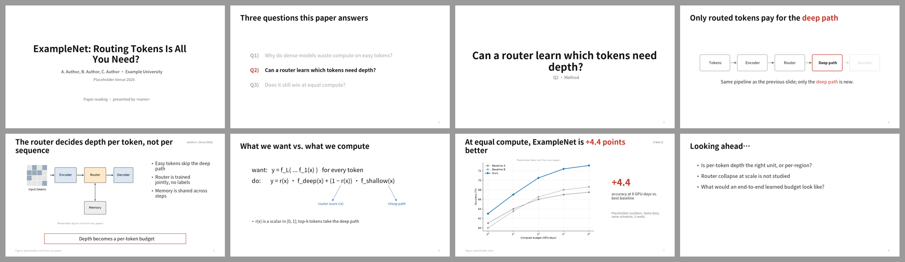
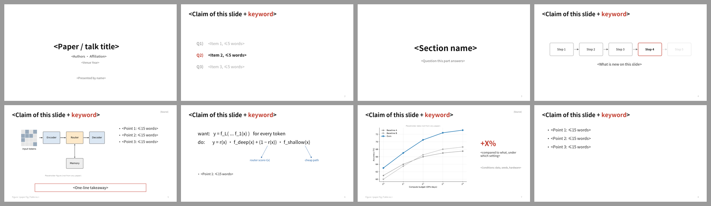

# International · 海外组会 / 会议风格预设

> 白底、标题即结论、图是主角、只有一种强调色。  
> 蒸馏自 Kaiming He、Chris Ré、Song Han、CS231n、Jure Leskovec 的公开 slides（见 `refs/`）。  
> 预设 = token + 页面原型 + 绘制函数；AI 仍需针对论文决定 message、裁图和最终构图。



## 1. 何时使用

- 英文汇报、海外组会、reading group、投稿前 rehearsal；
- 中文汇报但希望“极简海外风”也可用，CJK 字体自动回退。

## 2. Token（`tokens.json`）

### 字体

| 用途 | 首选 | 回退 |
|---|---|---|
| 英文 / 数字 | Arial | Helvetica → Calibri |
| 中文 | Microsoft YaHei | PingFang SC → Source Han Sans SC → Noto Sans SC |
| 代码 | Consolas | Menlo → DejaVu Sans Mono |

全稿最多两个字族。不要用衬线体做正文；公式可以用论文原图或 PPT 公式编辑器。

### 字号（pt，16:9 / 13.333 × 7.5 in）

| 元素 | 字号 | 规则 |
|---|---|---|
| 封面标题 | 40 bold | ≤ 2 行 |
| 页标题 | 32 bold | 一句结论或问题，≤ 2 行；英文 ≤ 60 字符，中文 ≤ 24 字 |
| 副标题 | 18 | 可选，灰色 |
| 正文 | 20 | 每页 ≤ 3 条，每条 ≤ 1 行（英文 ≤ 70 字符 / 中文 ≤ 26 字） |
| 辅助 | 16 | 读图提示、条件说明 |
| 图注 | 13 | |
| 来源 / 页码 | 11 | 左下来源、右下页码，浅灰 |
| 大数字 | 40 bold | 每页最多 1 个 |
| 章节 / 问题页 | 44 bold | 居中，一句话 |

### 配色（语义固定，全稿一致）

| Token | 色值 | 含义 |
|---|---|---|
| `text` | #111111 | 标题 |
| `body` | #262626 | 正文 |
| `muted` | #6B6B6B | 副标题、出处标签 |
| `faint` | #A6A6A6 | 来源、页码、非当前导航项 |
| `ghost` | #D0D0D0 | 增量构建中尚未讲到的部分 |
| `accent` | #C0392B | **唯一强调色**：本页新增内容 / 结论框 / 自家方法 / 关键数字 |
| `note` | #2563A6 | 讲解层：公式圈注、读图提示、机制说明框 |
| `highlight` | #FFF2CC | 代码或表格中“改动的那一行”的底色 |

论文原图保留原配色，不为统一色系改曲线颜色。

### 网格

- 左右边距 0.6 in；标题区 y = 0.38–1.13 in；内容区 y = 1.35–6.85 in；来源/页码 y = 7.05 in；
- 栏间距 0.35 in；
- 双栏默认 **62 / 38**（图 / 文），不用 50 / 50；
- 图面积 ≥ 内容区 55%。

## 3. 页面原型（`assets/style-presets.js` → `international.*`）

| 原型 | 用途 | 结构约束 | 参考 |
|---|---|---|---|
| `cover` | 封面 | 题目 + 作者机构 + 会议 + 汇报人；无 Logo 墙 | — |
| `questions` | 研究问题导航 | 2–5 个问题，当前项 accent + 粗体，其余 faint；可在每章开头重复 | `refs/leskovec-question-nav.jpg` |
| `section` | 章节 / 关键问题页 | 只有一句话 + 可选副标题，无 bullet；每 5–8 页一张 | `refs/han-section-page.jpg` |
| `buildSteps` | 增量构建 | 同一流程多页复用，已讲 = muted 边框，当前 = accent 粗边框，未讲 = ghost；标题里的新增词用 accent | `refs/cs231n-consistent-glyphs.jpg` |
| `figureNotes` | 图主文辅 | 左图 62%，右 ≤ 3 条短句；可选底部结论框 | `refs/kaiming-title-as-question.jpg` |
| `takeaway` | 结论框 | 单行描边框，居中，放视线终点；accent = 结论，note = 机制要点 | `refs/re-takeaway-box.jpg`、`refs/re-color-semantics.jpg` |
| `equation` | 公式讲解 | 公式 ≤ 2 行；“want / do”对照；讲解标签 note 色 + 细箭头，标签 ≤ 4 词 | `refs/kaiming-equation-annotation.jpg` |
| `result` | 结果页 | 原图/原表 + 右侧唯一大数字 + 实验条件小字 | `refs/kaiming-one-callout-result.jpg` |
| `closing` | 收尾 | Looking ahead / Open questions，≤ 3 条，用问题结尾 | — |

Goal / Challenge / Our Solution 三行骨架（`refs/han-goal-challenge-solution.jpg`）在 Domestic 预设中实现为 `paperGlance`，两种风格都可以借用。

## 4. 推荐页序

**8–10 分钟论文组会（约 10 页）**

```text
cover → questions(全部) → section(Q1) → figureNotes(动机)
→ questions(当前=Q2) → buildSteps×2(方法) → equation(可选)
→ result×1–2 → closing
```

**15–20 分钟（约 16–20 页）**：每个 Q 一组 `section → figureNotes/buildSteps → result`，中间插一次 `questions` 导航。

## 5. 硬性约束（视觉审阅时逐条检查）

1. 每页只用一种强调色（accent），note 色只出现在讲解层；
2. 标题能单独读成一句话；
3. 每页 bullet ≤ 3，没有第二层缩进；
4. 结果页只强调一个数，且注明比较对象与条件；
5. 增量构建页之间图元位置不变；
6. 不出现阴影、渐变、圆角卡片堆叠、Logo 墙、整页论文截图。

## 6. 用法

```js
const pptxgen = require('pptxgenjs');
const {loadTokens, PptxCanvas, drawSlide} = require('./assets/style-presets');

const t = loadTokens('international');
const deck = new pptxgen(); deck.layout = t.slide.layout;

drawSlide(new PptxCanvas(deck.addSlide(), t), t, {
  type: 'figureNotes',
  title: 'The router decides depth per token, not per sequence',
  tag: '[Author+, Venue 2026]',
  figure: 'figs/fig2-crop.png',
  points: ['Easy tokens skip the deep path', 'Router is trained jointly'],
  takeaway: 'Depth becomes a per-token budget',
  source: 'Fig. 2 of the paper', page: 5,
  notes: '先告诉听众怎么看这张图……',
});
await deck.writeFile({fileName: 'deck.pptx'});
```

文字内联标记：`[[关键词]]` → accent 色，`**粗体**` → 加粗。  
原型只是起点：渲染后看图，不合适就直接改坐标或换原型。

## 7. 参考图来源

`refs/` 为公开 slides 的低分辨率截图，仅用于风格研究与引用说明，版权归原作者：

- Kaiming He, *Towards End-to-End Generative Modeling*, CVPR 2025 Tutorial — <https://people.csail.mit.edu/kaiming/cvpr25talk/cvpr2025_meanflow_kaiming.pdf>
- Chris Ré, NeurIPS 2023 Keynote — <https://cs.stanford.edu/people/chrismre/papers/NeurIPS23_Chris_Re_Keynote_DELIVERED.pdf>
- Song Han, *Accelerating LLMs and Generative AI*, IAIFI 2024 — <https://iaifi.org/talks/2024_03_IAIFI_Symposium_Han.pdf>
- Stanford CS231n 2024 (Fei-Fei Li, Ehsan Adeli, Zane Durante) — <https://cs231n.stanford.edu/slides/2024/lecture_8.pdf>
- Jure Leskovec, Thesis Defense — <https://cs.stanford.edu/people/jure/pubs/thesis/jure-defense_pdf.pdf>

`samples/` 为本预设生成的示例页，内容是虚构的占位论文，图是占位图。

## 字体与基础模板

| 角色 | 首选 → 回退 | 开源替代 |
|---|---|---|
| 西文 | Arial → Helvetica → Calibri | Liberation Sans |
| 中日文 | Microsoft YaHei → PingFang SC → Source Han Sans SC → Noto Sans SC | 思源黑体 / Noto Sans SC |
| 等宽 | Consolas → Menlo → DejaVu Sans Mono | JetBrains Mono / DejaVu Sans Mono |

- 检查本机字体：`python scripts/check_fonts.py international`；来源、授权与安全字体组见 [fonts.md](../../references/fonts.md)。
- 基础模板：[template.pptx](template.pptx)（每页是带占位说明的原型，演讲备注写明这页该放什么），预览：



- 每页放什么内容：[page-content-guide.md](../../references/page-content-guide.md)。
