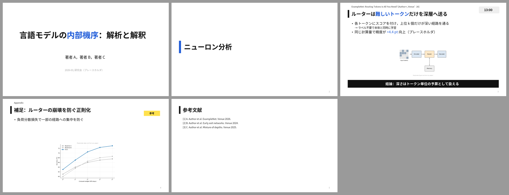
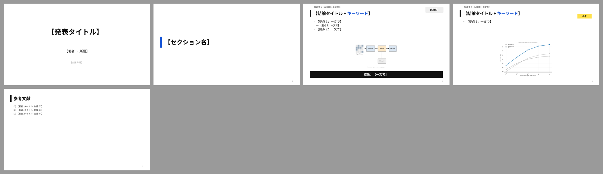

# JP Gothic · 日韩技术发表

> 日韩技术发表：粗黑体、黑色左竖条标题、标题上方论文出处行、单一强调色、时间徽章、「参考」贴纸、黑色结论横幅。  
> 蒸馏自 [slide-style-atlas.md](../../references/slide-style-atlas.md) 中归入本预设的样本；参考截图见 `refs/`。

## 1. 何时使用

- 日文/韩文报告；
- 论文合集分享（每页一篇论文）、勉强会、tutorial；
- 喜欢高信息密度但仍要清楚的中文组会也可借用。

## 2. Token（`tokens.json`）

- 字体：Noto Sans JP / Hiragino Sans / Meiryo；中文回退 Noto Sans SC（`fonts.heading` / `fonts.body` 决定 PPTX 字体，`fonts.preview` 只用于 SVG 预览）
- 字号：封面 46 · 标题 28 · 正文 20 · 辅助 16 · 章节 40

| 颜色 | 值 |
|---|---|
| `bg` | `#FFFFFF` |
| `primary` | `#1E5BD8` |
| `text` | `#111111` |
| `body` | `#262626` |
| `muted` | `#6B6B6B` |
| `faint` | `#A0A0A0` |
| `ghost` | `#D6D6D6` |
| `accent` | `#1E5BD8` |
| `frame` | `#EFEFEF` |
| `rule` | `#D9D9D9` |
| `sticker` | `#FFE14D` |

语义：

- `accent`：唯一强调色：标题关键词、图中对应元素、链接
- `text(black)`：标题左竖条、结论横幅
- `sticker`：「参考 / Skip」可跳过页贴纸

## 3. 页面原型

| 原型 | 说明 |
|---|---|
| `cover` | 居中粗黑体大标题，关键词强调色 |
| `section` | 强调色左竖条 + 章节名 |
| `read` | 论文出处行 + 黑竖条标题 + 要点（→ 子点）+ 图 + 黑色结论横幅；可加时间徽章 `badge`、可跳过贴纸 `optional` |
| `references` | 参考文献页 |

示例 deck：`node assets/build-style-samples.js out` 后查看 `out/jp-gothic-sample.pptx`。

## 4. 硬性约束

- 全稿只有一个强调色，标题关键词与图中对应元素同色
- 结论横幅每页最多一条，白字黑底
- 可跳过页统一贴「参考」/ Skip（P19）
- 预设是起点不是模板：坐标、原型都可以改，但 token 语义不变。

## 5. 参考来源（低分辨率截图，仅用于说明手法）

| 截图 | 来源 | 风格族 | 链接 |
|---|---|---|---|
| `refs/kantocv_ja-p13.jpg` | CV × Scientific Figures (第67回CV勉強会@関東) — Takuro Kawada, Hosei Univ. (Iyatomi Lab)（kantoCV 67th (CVPR 2026 reading) 2026） | paper-reading black left-bar | [PDF](https://files.speakerdeck.com/presentations/026f34715fb3413198f4f339b167bb4e/CV%E5%8B%89%E5%BC%B7%E4%BC%9A__3_.pdf) |
| `refs/yokoi_ja-p38.jpg` | 言語モデルの内部機序：解析と解釈 (NLP2025 tutorial) — Heinzerling, 横井祥, 小林悟郎 (RIKEN/東北大/国語研)（言語処理学会 NLP2025） | speakerdeck JP heavy-gothic tutorial | [PDF](https://files.speakerdeck.com/presentations/34463d58208d4999832c40cca50e5ea1/NLP_2025_interpretability_tutorial__%E6%8F%90%E5%87%BA%E7%89%88_-.pdf) |
| `refs/utokyo_suzuki-p45.jpg` | 深層学習の数理 — 鈴木大慈 / 東京大学 (intensive lecture at Tohoku Univ.)（東北大学集中講義 2023） | Japanese navy title bar dense theory | [PDF](https://ibis.t.u-tokyo.ac.jp/suzuki/lecture/2023/TohokuUniv/%E6%9D%B1%E5%8C%97%E5%A4%A7%E5%AD%A62023.pdf) |
| `refs/okada-p4.jpg` | 2層k-平面性と外k-平面性判定のパラメータ化計算量 — Kobayashi, Okada, Wolff (Hokkaido/Nagoya/Würzburg)（RAOTA 若手研究者の集い 2025） | Japanese theory talk, single orange accent | [PDF](https://yutookada.com/slides/raota-tsukuba2025.pdf) |

## 字体与基础模板

| 角色 | 首选 → 回退 | 开源替代 |
|---|---|---|
| 西文 | Noto Sans JP → Hiragino Sans → Meiryo | （开源） |
| 中日文 | Noto Sans JP → Hiragino Sans → Yu Gothic → Noto Sans SC | （开源） |
| 等宽 | Consolas → DejaVu Sans Mono | JetBrains Mono / DejaVu Sans Mono |

- 检查本机字体：`python scripts/check_fonts.py jp-gothic`；来源、授权与安全字体组见 [fonts.md](../../references/fonts.md)。
- 基础模板：[template.pptx](template.pptx)（每页是带占位说明的原型，演讲备注写明这页该放什么），预览：

- 每页放什么内容：[page-content-guide.md](../../references/page-content-guide.md)。
