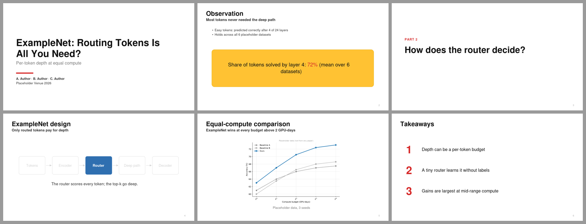
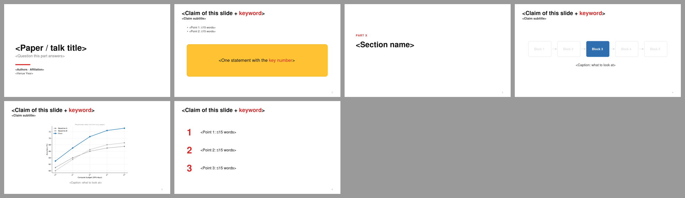

# Keynote Minimal · 白底极简发布会式

> 白底、粗标题 + 一行加粗结论、极少字、一页一个视觉；构建动画代替要点列表。  
> 蒸馏自 [slide-style-atlas.md](../../references/slide-style-atlas.md) 中归入本预设的样本；参考截图见 `refs/`。

## 1. 何时使用

- 英文 reading group、会议 rehearsal、job talk；
- 中文汇报但导师偏好“苹果发布会式”简洁；
- 内容能拆成很多张“一页一个意思”的页面时。

## 2. Token（`tokens.json`）

- 字体：Helvetica Neue（Keynote）/ Arial；中文 苹方 → 微软雅黑（`fonts.heading` / `fonts.body` 决定 PPTX 字体，`fonts.preview` 只用于 SVG 预览）
- 字号：封面 48 · 标题 32 · 正文 20 · 辅助 16 · 章节 44

| 颜色 | 值 |
|---|---|
| `bg` | `#FFFFFF` |
| `primary` | `#2F6FB0` |
| `text` | `#111111` |
| `body` | `#333333` |
| `muted` | `#7A7A7A` |
| `faint` | `#A8A8A8` |
| `ghost` | `#D6D6D6` |
| `accent` | `#D62828` |
| `highlight` | `#FFC233` |
| `highlightLine` | `#E0A800` |
| `frame` | `#F2F2F2` |
| `rule` | `#E0E0E0` |

语义：

- `accent`：本页唯一关键数字 / 封面短线
- `highlight`：观察/结论大卡片底色（每 5–8 页最多一次）
- `primary`：focus 构建中当前模块
- `ghost`：focus 构建中非当前模块

## 3. 页面原型

| 原型 | 说明 |
|---|---|
| `cover` | 左对齐大标题 + 灰色副标题 + 红色短线 + 作者/会议 |
| `statement` | 标题 + 加粗结论副标题 + 至多 2 条要点 + 黄色大卡片（一个关键数字标红） |
| `section` | 小号大写 kicker（PART 2）+ 一句问题 |
| `focus` | 同一张模块图连续多页，只有当前模块实心，其余灰框 |
| `figure` | 标题 + 结论副标题 + 一张大图 + 一行条件说明 |
| `closing` | 编号大数字 + 三条结论 |

示例 deck：`node assets/build-style-samples.js out` 后查看 `out/keynote-minimal-sample.pptx`。

## 4. 硬性约束

- 每页英文 ≤ 30 词 / 中文 ≤ 60 字；超过就拆页。只数正文和要点，不含标题、副标题、出处行和图内文字；自绘图解里的文字算正文。中英混排时，一个汉字算 1，一个英文单词或一个数字串算 1
- 大数字页（规模、主结果）用 `size.heroNumber`（64 pt）写数字、`size.heroUnit`（30 pt）写单位，同一行可以有两个数（如“1100 万 张图 · 11 亿 个 mask”），整页不超过两个大数字；`bigNumber`（40）用于和图并排的数字。没有专用原型，用 `head` 加 `c.text({runs: [...]})` 画
- 黄色大卡片每 5–8 页最多出现一次，只放“观察/结论”
- 强调色红只给一个数字；模块高亮用 primary 蓝，两者不混用
- 标题可以是名词短语，结论放在加粗副标题里（P16）
- 预设是起点不是模板：坐标、原型都可以改，但 token 语义不变。

## 5. 参考来源（低分辨率截图，仅用于说明手法）

| 截图 | 来源 | 风格族 | 链接 |
|---|---|---|---|
| `refs/s3fifo-p8.jpg` | FIFO Queues are All You Need for Cache Eviction (S3-FIFO) — Juncheng Yang, K. V. Rashmi et al. / CMU Parallel Data Lab, Emory, Pelikan（SOSP 2023） | bold Graphik headline + subtitle, off-white | [PDF](https://jasony.me/slides/sosp23-s3fifo.pdf) |
| `refs/eden-p13.jpg` | Eden: Developer-friendly Application-integrated Far Memory — Anil Yelam, Alex C. Snoeren et al. / UC San Diego, VMware (Broadcom)（NSDI 2025） | Google Slides minimal white | [PDF](https://www.usenix.org/system/files/nsdi25_slides-yelam.pdf) |
| `refs/chajed-p34.jpg` | Verifying a concurrent, crash-safe file system with sequential reasoning — Tej Chajed, MIT PDOS (systems verification)（MIT PhD defense, 2021-10-21） | minimal Open Sans + teal systems diagrams | [PDF](https://www.chajed.io/papers/tchajed-thesis-slides.pdf) |
| `refs/pku_wangdi-p26.jpg` | 保证引导程序组合正确性的可编程 MCMC — 王迪 北京大学（2024 (OOPSLA'24 work, Chinese talk)） | Keynote grey gradient minimal builds | [PDF](https://stonebuddha.github.io/talks/pmscgp.pdf) |

## 字体与基础模板

| 角色 | 首选 → 回退 | 开源替代 |
|---|---|---|
| 西文 | Helvetica Neue → Arial | Inter / Nimbus Sans |
| 中日文 | PingFang SC → Microsoft YaHei → Noto Sans SC | 思源黑体 / Noto Sans SC |
| 等宽 | Menlo → Consolas → DejaVu Sans Mono | DejaVu Sans Mono |

- 检查本机字体：`python scripts/check_fonts.py keynote-minimal`；来源、授权与安全字体组见 [fonts.md](../../references/fonts.md)。
- 基础模板：[template.pptx](template.pptx)（每页是带占位说明的原型，演讲备注写明这页该放什么），预览：

- 每页放什么内容：[page-content-guide.md](../../references/page-content-guide.md)。
