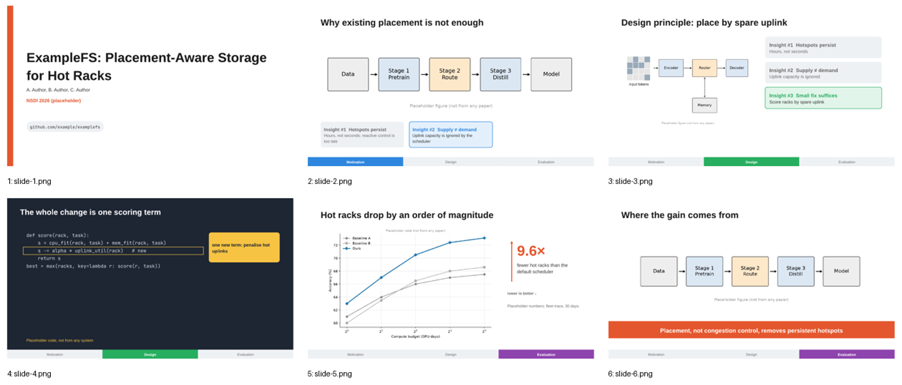
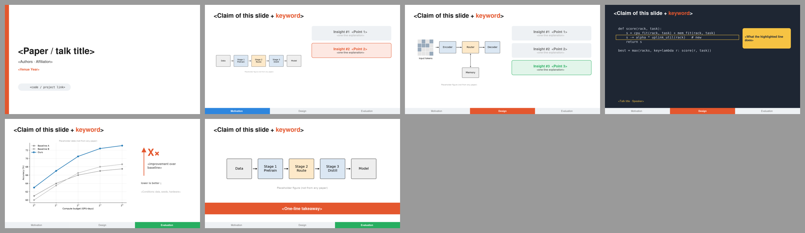

# Systems Talk · 系统顶会报告

> 系统顶会报告：底部贡献追踪条、累积 Insight 卡、比值箭头结果、深色代码页、整宽结论横幅。  
> 蒸馏自 [slide-style-atlas.md](../../references/slide-style-atlas.md) 中归入本预设的样本；参考截图见 `refs/`。

## 1. 何时使用

- NSDI/OSDI/SOSP/SIGCOMM/EuroSys/FAST 等系统、网络、存储、数据库论文；
- “测量 → 洞见 → 设计 → 评测”结构的工作。

## 2. Token（`tokens.json`）

- 字体：Arial / Helvetica；代码 Consolas/Menlo（`fonts.heading` / `fonts.body` 决定 PPTX 字体，`fonts.preview` 只用于 SVG 预览）
- 字号：封面 44 · 标题 30 · 正文 20 · 辅助 16 · 章节 40

| 颜色 | 值 |
|---|---|
| `bg` | `#FFFFFF` |
| `primary` | `#1F3A5F` |
| `ours` | `#E4572E` |
| `text` | `#1A1A1A` |
| `body` | `#333333` |
| `muted` | `#6B6B6B` |
| `faint` | `#A6A6A6` |
| `ghost` | `#D0D0D0` |
| `accent` | `#E4572E` |
| `frame` | `#EEF1F4` |
| `rule` | `#D9D9D9` |
| `dark` | `#1E2633` |
| `callout` | `#F6C343` |

语义：

- `ours`：本文系统在所有图、条形和比值箭头中的固定颜色
- `sym`：贡献追踪条 / Insight 卡片的分段颜色，按贡献编号固定
- `callout`：深色代码页的唯一标注色

## 3. 页面原型

| 原型 | 说明 |
|---|---|
| `cover` | 左侧本文色竖条 + 标题 + 作者 + 会议（本文色）+ 代码仓库胶囊 |
| `insights` | 左图右卡：Insight #1…#k 逐页累积，当前卡上色，旧卡转灰，未讲的不出现 |
| `code` | 深色全屏代码，框出改动行，黄色气泡解释 |
| `resultRatio` | 原图 + 大号“N.N×”比值箭头 + “better ↓”方向提示 + 条件小字 |
| `banner` | 图 + 底部整宽本文色横幅写一句结论 |
| `tracker` | 任一内容页传入 tracker/stage 即在底部画贡献追踪条（P13） |

示例 deck：`node assets/build-style-samples.js out` 后查看 `out/systems-talk-sample.pptx`。

## 4. 硬性约束

- `ours` 色只代表本文系统：标题强调、条形、比值箭头都用它
- 追踪条分段 = 论文的贡献或章节，3–4 段；颜色按段固定
- Insight 卡最多 4 张，每张一行标题 + 一行解释
- 代码页只框一行；深色页之后回到白底
- 预设是起点不是模板：坐标、原型都可以改，但 token 语义不变。

## 5. 参考来源（低分辨率截图，仅用于说明手法）

| 截图 | 来源 | 风格族 | 链接 |
|---|---|---|---|
| `refs/skyplane-p19.jpg` | Skyplane: Optimizing Transfer Cost and Throughput Using Cloud-Aware Overlays — Paras Jain, Joseph E. Gonzalez, Ion Stoica et al. / UC Berkeley Sky Computing Lab（NSDI 2023） | open-source product launch, insight cards | [PDF](https://www.usenix.org/system/files/nsdi23_slides_jain.pdf) |
| `refs/bolt-p11.jpg` | BOLT: Sub-RTT Congestion Control for Ultra-Low Latency — Serhat Arslan, Yuliang Li, Gautam Kumar, Nandita Dukkipati / Stanford, Google（NSDI 2023） | Google-color tracker bar footer | [PDF](https://www.usenix.org/system/files/nsdi23_slides_arslan.pdf) |
| `refs/klimovic-p28.jpg` | Data Management for Cost-Efficient ML — Ana Klimovic / ETH Zürich (EASL, Systems Group)（EuroSys 2024 CHEOPS workshop keynote） | Avenir light minimal + dark code-walkthrough slides | [PDF](https://cheops-workshop.github.io/talks2024/EuroSys24_CHEOPSkeynote_klimovic_CostEffectiveML.pdf) |
| `refs/graviton-p20.jpg` | Graviton: Trusted Execution Environments on GPUs — Stavros Volos, Kapil Vaswani, Rodrigo Bruno / Microsoft Research, Univ. of Lisbon（OSDI 2018） | Segoe light corporate + takeaway banner | [PDF](https://www.usenix.org/sites/default/files/conference/protected-files/osdi18_slides_volos.pdf) |

## 字体与基础模板

| 角色 | 首选 → 回退 | 开源替代 |
|---|---|---|
| 西文 | Arial → Helvetica | Liberation Sans |
| 中日文 | Microsoft YaHei → PingFang SC → Noto Sans SC | 思源黑体 / Noto Sans SC |
| 等宽 | Consolas → Menlo → DejaVu Sans Mono | JetBrains Mono / DejaVu Sans Mono |

- 检查本机字体：`python scripts/check_fonts.py systems-talk`；来源、授权与安全字体组见 [fonts.md](../../references/fonts.md)。
- 基础模板：[template.pptx](template.pptx)（每页是带占位说明的原型，演讲备注写明这页该放什么），预览：

- 每页放什么内容：[page-content-guide.md](../../references/page-content-guide.md)。
