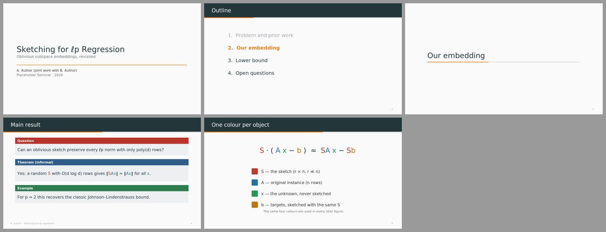
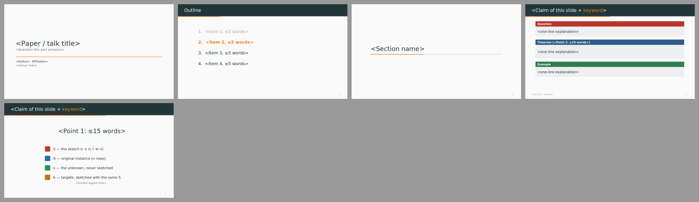

# Theory Beamer · Metropolis 式理论报告

> Metropolis 式：深色标题栏 + 橙色进度线、Theorem/Question/Example 固定色块、一个符号一种颜色。  
> 蒸馏自 [slide-style-atlas.md](../../references/slide-style-atlas.md) 中归入本预设的样本；参考截图见 `refs/`。

## 1. 何时使用

- 理论、算法、密码学、优化、数学类报告；
- 原稿是 Beamer、需要 PPTX 版本时；
- 公式多、需要逐项讲解符号的页面。

## 2. Token（`tokens.json`）

- 字体：Fira Sans（Metropolis 默认）→ Calibri；公式 Cambria Math；中文思源黑体（`fonts.heading` / `fonts.body` 决定 PPTX 字体，`fonts.preview` 只用于 SVG 预览）
- 字号：封面 38 · 标题 26 · 正文 20 · 辅助 16 · 章节 36

| 颜色 | 值 |
|---|---|
| `bg` | `#FAFAFA` |
| `dark` | `#23373B` |
| `primary` | `#23373B` |
| `text` | `#23373B` |
| `body` | `#333333` |
| `muted` | `#6B7378` |
| `faint` | `#A3A9AD` |
| `ghost` | `#D3D6D8` |
| `accent` | `#EB811B` |
| `frame` | `#D3D6D8` |
| `rule` | `#D3D6D8` |
| `blockBody` | `#EDEFF0` |

语义：

- `accent`：进度线、提纲当前项
- `block`：块类型 → 固定颜色（定理蓝 / 问题红 / 例子绿 / 定义深灰）
- `sym`：每个符号一种颜色，公式、图、文字三处一致

## 3. 页面原型

| 原型 | 说明 |
|---|---|
| `cover` | 左对齐标题 + 副标题 + 橙色细线 + 作者/场合 |
| `outline` | 编号提纲，当前项橙色，已讲项变灰 |
| `section` | 居中章节名 + 进度条 |
| `blocks` | 1–3 个类型块：Question 红 / Theorem 蓝 / Definition 灰 / Example 绿 |
| `symbols` | 一行公式，每个符号一种颜色 + 同色图例（P12） |

示例 deck：`node assets/build-style-samples.js out` 后查看 `out/theory-beamer-sample.pptx`。

## 4. 硬性约束

- 块类型 → 颜色全稿固定，不要临时换色
- `{{n:x}}` 给符号上色；同一符号在公式、图、正文中必须同色
- 每页最多 3 个块；定理写“informal”版本，正式版本放备份页
- 进度线 `progress` 按页码递增
- 预设是起点不是模板：坐标、原型都可以改，但 token 语义不变。

## 5. 参考来源（低分辨率截图，仅用于说明手法）

| 截图 | 来源 | 风格族 | 链接 |
|---|---|---|---|
| `refs/schadlich-p19.jpg` | Secure Computation on Encrypted Data in Multi-User Systems — Robert Schädlich, DIENS École normale supérieure / PSL / CNRS / Inria（ENS Paris PhD defense, 2025-12-02） | Beamer Metropolis-light (Fira) + handwritten annotations | [PDF](https://rschaedlich.github.io/assets/slides/PhD_Defense.pdf) |
| `refs/furnsinn-p12.jpg` | Arithmetic and Effective Aspects of Linear Differential Equations — Florian Fürnsinn, University of Vienna (mathematics)（Univ. of Vienna PhD defense, 2026-07-02） | Beamer navy miniframes (Frankfurt-style) + colored theorem blocks | [PDF](https://homepage.univie.ac.at/florian.fuernsinn/wp-content/uploads/2026/07/slides.pdf) |
| `refs/yasuda-p16.jpg` | Algorithms for Matrix Approximation: Sketching, Sampling, and Sparse Optimization — Taisuke (Tai) Yasuda, CMU Computer Science（CMU PhD thesis defense, ~2024） | Keynote theory talk, rounded-box theorems + matrix blocks | [PDF](https://taisukeyasuda.github.io/docs/phd-thesis/slides.pdf) |
| `refs/redleaf-p20.jpg` | RedLeaf: Isolation and Communication in a Safe Operating System — Vikram Narayanan, Anton Burtsev et al. / UC Irvine, VMware Research（OSDI 2020） | Beamer Metropolis code-diagram | [PDF](https://www.usenix.org/sites/default/files/conference/protected-files/osdi20_slides_narayanan_vikram.pdf) |

## 字体与基础模板

| 角色 | 首选 → 回退 | 开源替代 |
|---|---|---|
| 西文 | Fira Sans → Calibri | （开源） |
| 中日文 | Source Han Sans SC → Microsoft YaHei → Noto Sans SC | （开源） |
| 等宽 | Fira Mono → Consolas → DejaVu Sans Mono | （开源） |
| 公式 | Cambria Math | STIX Two Math |

- 检查本机字体：`python scripts/check_fonts.py theory-beamer`；来源、授权与安全字体组见 [fonts.md](../../references/fonts.md)。
- 基础模板：[template.pptx](template.pptx)（每页是带占位说明的原型，演讲备注写明这页该放什么），预览：

- 每页放什么内容：[page-content-guide.md](../../references/page-content-guide.md)。
